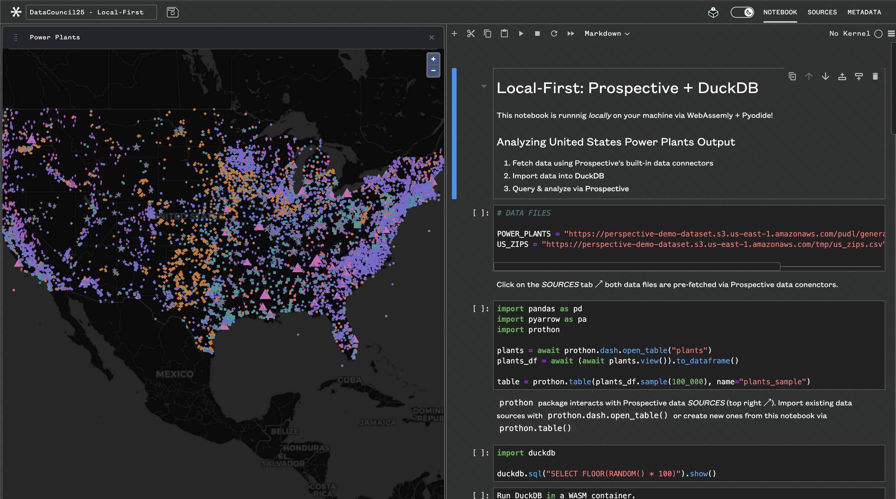

# Prospective Data Council 2025

**[Prospective](https://prospective.co)** workshop in Data Council 2025, focusing on an innovative _**local-first**_ approach for data analysis. 

In this workshop, we will explore how to integrate [DuckDB](https://duckdb.org/) and [Perspective](https://github.com/finos/perspective) to create an all in-browser, WebAssembly (WASM)-based, high-performance data visualization and analysis solution. 

<br/>

## Prospective Overview Dashboard

[](https://prospective.co/?q=9QIkBG3uHlc)

[**Click here**](https://prospective.co/?q=9QIkBG3uHlc) to explore the _interactive_ dashboard.

This dashboard introduces the dataset and highlights the basic features of Prospective.

**Note**: For the best WebAssembly (WASM) experience, use Chrome. 

<br/>

## Installation

### 1. Install npm Packages

Ensure you have Node.js installed before proceeding.

Navigate to the project directory and install the required npm packages, including `vite`, `perspective`, and `duckdb`:

```bash
cd prospective-datacouncil-2025
npm install
```

### 2. Start the Development Server

Run the Vite development server:

```bash
npm run dev
```

### 3. View the Application

Open **Chrome** and navigate to: [http://localhost:5173/](http://localhost:5173/)

- Click the database icon to load data into DuckDB.
- Adjust query settings using the gear icon.
- Use the refresh icon to run and update the Perspective Viewer.

### 4. Explore the Streaming Application

Open **Chrome** and navigate to: [http://localhost:5173/streaming.html](http://localhost:5173/streaming.html)

This application simulates a data stream by playing the power plants dataset month by month at short intervals (e.g., 250ms).


<br/><br/>

Questions and comments: parham@prospective.co
